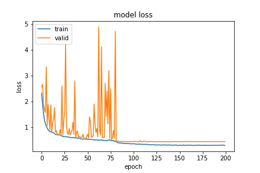

\newpage

# Introduction

The _SETI_ (Search for Extra-Terrestrial Intelligence) is an american set of projects started in 1960 aiming to find proof of alien intelligence by listening to space signals. Nowadays, those signals are recovered using the specially built _Allen Telescope Array_. 

SETI researchers receive a lot of signals everyday, and therefore rely on an automated system (called SonATA) to classify them. In 2017, the SETI launched an open competition asking participant to build a solution to replace SonATA by creating a software able to classify space signals in one of seven categories. The SETI also supplied competitors with datas, taking the form of synthetic signals they generated themselves.

After the competition, the competition's dataset was released on the internet, and we decided to use it to apply techniques learned in this class.

# Dataset

# Model

To classify those signals, we use ResNet50 v1. ResNet is a very deep neural network, consisting of around 50 convolution and pooling layers.

To reduce the general problems around deep neural networks, ResNet authors introduced the residual block.

# Results

# Conclusion

