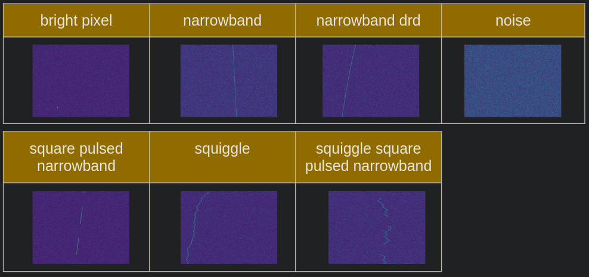
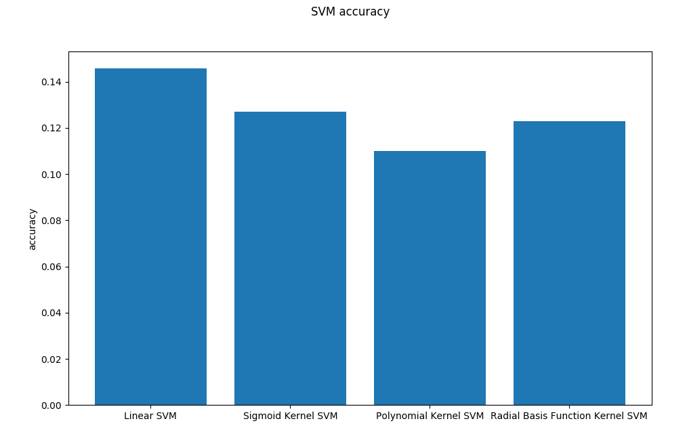
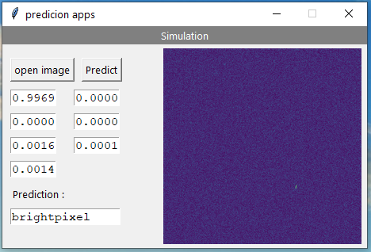

\begin{center}
\it{the project is available on the following github : https://github.com/BagusYusuf/SetiProject}
\end{center}

\newpage

# Introduction

The _SETI_ (Search for Extra-Terrestrial Intelligence) is an american set of projects started in 1960 aiming to find proof of alien intelligence by listening to space signals. Nowadays, those signals are recovered using the specially built _Allen Telescope Array_. 

SETI researchers receive a lot of signals everyday, and therefore rely on an automated system (called SonATA\footnote{http://wiki.setiquest.info/index.php/SonATA}) to classify them. In 2017, the SETI launched an open competition asking participants to build a solution to replace SonATA by creating a software able to classify space signals in one of seven categories. The SETI also supplied competitors with datas, taking the form of synthetic signals they generated themselves. The winning team was _Eefsubsee_\footnote{https://github.com/sgrvinod/Wide-Residual-Nets-for-SETI} __[3]__, with an impressive score of 94.99% accuracy.

After the competition, the competition's dataset was released on the internet\footnote{more specifically, on kaggle : https://www.kaggle.com/tentotheminus9/seti-data}, and we decided to use it to apply techniques learned in this class.

# Task

Our task is, given a signal's spectrogram\footnote{The spectrogram of a signal is a graph of its frequency versus time, the color of points usually providing the power of the signal as an additional dimension. Beware that in our case, spectrograms are actually presented with frequency in the x-axis and time in the y-axis.}, output its class as one of the seven possible ones :

* _bright pixel_ : A very powerful signal limited in time.
* _narrowband_ : A signal with a frequency varying over a constant drift rate. Such a signal may be a sign a purposely built transmitter, therefore, it is one of the most interesting ones.
* _narrowband drd_ : A signal with a frequency varying over a varying drift rate. 
* _noise_ : This signal is probably the least interesting one for the SETI researchers, and should be discarded.
* _square pulsed narrowband_ : A narrowband signal with a periodic amplitude modulation.
* _squiggle_ : A narrowband-like signal, with bounded random frequency variation.
* _squiggle square pulsed narrowband_ : A squiggle with periodic amplitude modulation.

# Dataset

The data is comprised of artificial signals generated by the SETI project. We split it as follows :

| train set | test set | validation set | total |
|:---------:|:--------:|:--------------:|:-----:|
|   5600    |    700   |       700      |  7000 |

The dataset is balanced, as each of the seven class is equally represented in each set. However, in a real-life scenario, noise signals would be far more frequent, which is probably one of the reason behind the SETI researcher generating the dataset themselves.

\newpage

# Baselines

As baselines, we propose to use K Nearest Neighbours and SVM techniques.

## K Neareast Neighbours

Our best KNN result (using $k = 1$) obtains only 19.14%, making it a pretty low baseline.  However, this was to be expected, as KNN usually don't perform very well in image related problems due to the complexity of those kinds of problems.

## SVM

Similarly to KNN, SVM doesn't perform really well on this task, the linear SVM obtaining an accuracy of 14.57%, which is not much better than a random classifier in this case\footnote{having 7 classes, we can expect a random classifier to have an accuracy of $\frac{1}{7} \approx 0.1429$}.

# Model

To classify those signals, we decided to use ResNet50 v1 __[2]__. ResNet50 is a very deep neural network, consisting of around 50 convolution and pooling layers.

## Architecture

ResNet is composed of 4 main stages, each acting as a bottleneck : after each one, the input height and width decrease, while its depth increases. Each stage contains 3 to 6 residual blocks, each comprised of three convolution layers of respective dimensions 1x1, 3x3 and 1x1. 

The first 1x1 layer task is to reduce the depth of the input. By doing so, it reduces the number of overall computations, by reducing the numbers of parameters of the 3x3 layer. Finally, the last 1x1 layer restores the original dimension.

As an example, let's say that the input of such a layer has a depth of 256, and its output should also have a depth of 256. By not using the above described trick, the number of parameters to learn would be :

$$(3 \times 3 \times 256 + 1) \times 256 = 590080$$

Now, if we add a 1x1 layer shrinking depth to 64, and another one restoring it to 256, we get :

$$(1 \times 1 \times 256 + 1) \times 64 + (3 \times 3 \times 64 + 1) \times 64 + (1 \times 1 \times 64) \times 256 = 70016$$

## Residual blocks

To reduce the general problems around deep neural networks, ResNet authors introduced the _residual block_ concept.

A residual block is composed of classic deep-learning neural networks layers (in the case of ResNet, convolution layers), but the input of these layers is fast-forwarded to their output, so that the output of a residual block $H$ with layers represented by their computed function $F$ is :

$$H(x) = F(x) + x$$

which means the residual block layers are trying to learn the function

$$F(x) = H(x) - x$$

This function is perfectly learnable by a neural network, and doesn't add any complexity.  Moreover, it is a solution to the vanishing of gradient in deep neural networks. Summing the output of $F$ and its input ensures that the gradient will get distributed to the previous layer during backpropagation as :

$$\nabla H(x) = \nabla(F(x) + x) = \nabla F(x) + \nabla x$$

which means that even is $\nabla F(x)$ somehow vanishes, $\nabla x$ is not lost.

## Data augmentation

To increase our performace, we use _image data augmentation_ : We generate new, plausible samples from the training datas. This technique has been shown __[1]__ to increase performance of image related tasks. To perform data augmentation, we use the _ImageDataGenerator_ class from Keras to randomly apply transformations on the training datas : flipping, adding noise, shifting...

# Results

+-----------------------+----------+
|      Model            | Accuracy |
+:======================+:========:+
| Polynomial SVM        |   11.00  |
+-----------------------+----------+
| RBF SVM               |   12.29  |
+-----------------------+----------+
| Sigmoid SVM           |   12.71  |
+-----------------------+----------+
| Random (expected)     |   14.29  | 
+-----------------------+----------+
| Linear SVM            |   14.57  |
+-----------------------+----------+
| KNN (k=1)             |   19.14  | 
+-----------------------+----------+
| __ResNet50 (ours)__   | __89.00__|
+-----------------------+----------+
| _Eefsubsee_           |  _94.99_ |
+-----------------------+----------+

Using our best run, we achieve a result of _89.00_ accuracy, which is pretty high.

When training, the loss of our model starts to be very stable after the $100^{th}$ epoch.  Similarly, our model validation accuracy stops improving after around 100 epochs.

Our confusion matrix shows most errors come from wrongly classifying _noise_ signals as _bright pixel_, and _narrowband_ as _narrowband drd_. This is not a surprise, as those signals seems pretty similar to our human eye.

# Graphical interface

To demonstrate our results, we built a simple GUI using python and tk. Using this GUI, an user can select any spectrogram and see the prediction of our model (provided he trained the model beforehand).

Using our best run, we achieve a result of _89.00_ accuracy, which is pretty high 

The loss of our model starts to be very stable after the $100^{th}$ epoch.

Similarly, our model validation accuracy stops improving after around 100 epochs.

# Conclusion

Our model performance largely outperforms our weak baselines, and delivers good results, but falls short of Eefsubsee (the SETI competition winning team) impressive work __[3]__, which shows we still have a lot of room for improvements. 

\newpage

# References

* __[1]__ Hernandez-Garcia and P. Konig. Data augmentation instead of explicit regularisation. _arXiv preprint arXiv:1806.03852, 2018a._
* __[2]__ He et al. Deep Residual Learning for Image Recognition. _arXiv preprint arXiv:1512.03385, 2015_
* __[3]__ Cox et al. Classification of simulated radio signals using Wide Residual Networks for use in the search for extra-terrestrial intelligence. _arxiv preprint arXiv:1803:08624, 2018_
